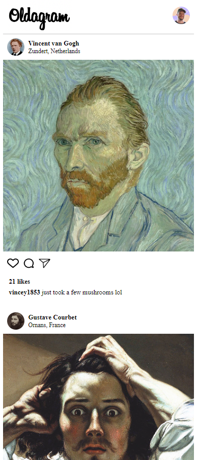

# Instagram Clone

Project is a replication of instagrams UI. Created to demonstrate skills and proficiency using HTML, CSS. 

## Features

- HTML and CSS provide structure and styling for the application.
- Javascript to create element tags for all the content from the div that holds the other tags, to the p tag for text. 